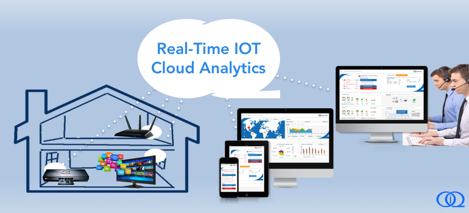

#What is Omny IQ?
[Omny IQ](http://www.omnyiq.com) provides responsive diagnostics, analytics, visualization and control software for your connected hardware devices to perform optimally and collaborate reliably in an increasingly complex connected environment. Our goal is to eliminate your need for writing server code or maintaining servers for these functions. Using this OmnyIQ-SDK, all it takes is a few lines of code to save data to and retrieve data from the Omny IQ cloud and to use the applications we provide for troubleshooting, remote diagnostics and preventive care.

#OmnyIQ-SDK
OmnyIQ-SDK enables a connected device to securely upload diagnostics data to the Omny IQ cloud using XMPP secure messaging protocol. Then from the cloud we can visualize diagnostics and analytics information from the data captured from the device as well as send requests to the device to execute commands.

OmnyIQ-SDK provides simple ANSI C based APIs that allows it to be integrated with the firmware of most IoT devices.

###Documentation
[Getting Started](docs/GettingStarted.md)

[API](docs/API.md)

###Support
Email to support@omnyiq.com

###License
The project is licensed under the Apache License, Version 2.0.